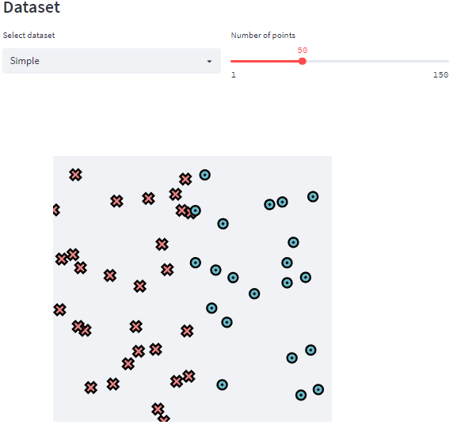
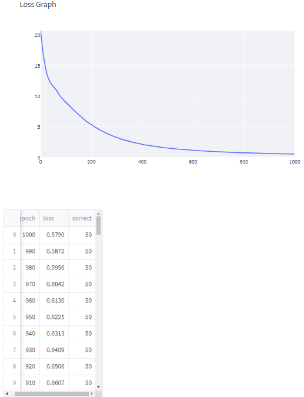
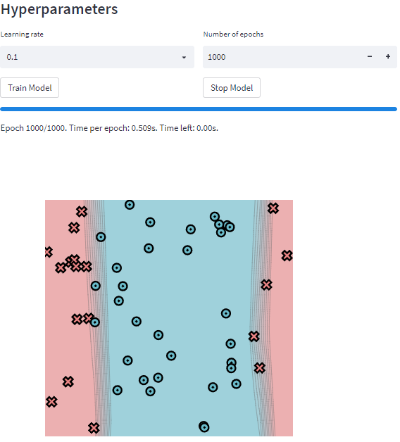
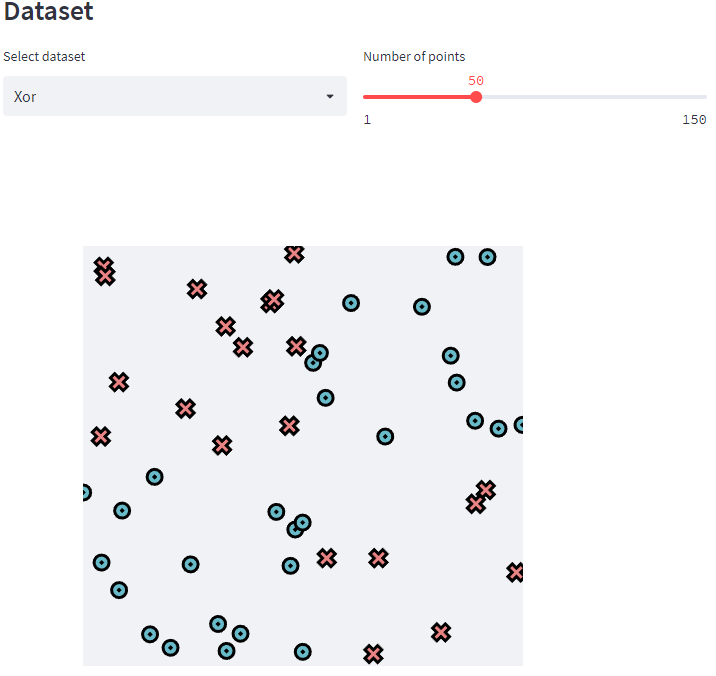

[](https://classroom.github.com/a/YFgwt0yY)
# MiniTorch Module 2


* Docs: https://minitorch.github.io/

* Overview: https://minitorch.github.io/module2/module2/

This assignment requires the following files from the previous assignments. You can get these by running

```bash
python sync_previous_module.py previous-module-dir current-module-dir
```

The files that will be synced are:

        minitorch/operators.py minitorch/module.py minitorch/autodiff.py minitorch/scalar.py minitorch/scalar_functions.py minitorch/module.py project/run_manual.py project/run_scalar.py project/datasets.py


## Task 2.5: Training
### TODO

Implement a neural network over the data with three linears (2-> Hidden (relu), Hidden -> Hidden (relu), Hidden -> Output (sigmoid)). It should do exactly the same thing as the corresponding functions in project/run_scalar.py, but now use the tensor code base.

Train a tensor model and add your results for all datasets to the README.

Record the time per epoch reported by the trainer. (It is okay if it is slow).


### Simple
#### DataSet

#### Model

#### Hyperparameters and Final Images

#### Training Logs


### Diag
#### DataSet

#### Model

#### Hyperparameters and Final Images

#### Training Logs


### Split
#### DataSet

#### Model

#### Hyperparameters and Final Images

#### Training Logs


### Xor
#### DataSet

#### Model

#### Hyperparameters and Final Images

#### Training Logs


